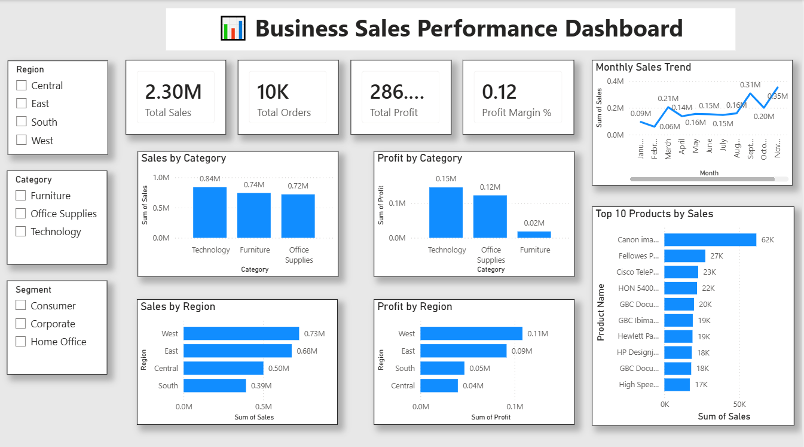

# 📊 Business Sales Performance Dashboard

## 📌 Project Overview

This project presents an interactive **Business Sales Performance Dashboard** built using **Microsoft Power BI**. The dashboard analyzes sales data to identify business performance, regional trends, product performance, and profitability. It provides key insights through interactive visualizations that support data-driven decision-making.

---

## 🎯 Objectives

* Analyze overall business sales performance.
* Track key performance indicators (KPIs).
* Identify top-performing product categories.
* Compare sales and profit across different regions.
* Analyze monthly sales trends.
* Identify the top-selling products.
* Enable interactive filtering using slicers.

---

## 🛠️ Tools & Technologies

* Microsoft Power BI
* Power Query
* DAX (Data Analysis Expressions)
* CSV Dataset (Sample Superstore)

---

## 📂 Dataset

* **Dataset Name:** Sample Superstore
* **Format:** CSV
* **Records:** Approximately 9,994 rows

---

## 📈 Key Performance Indicators (KPIs)

* 💰 Total Sales
* 💵 Total Profit
* 📦 Total Orders
* 📊 Profit Margin (%)

---

## 📊 Dashboard Features

### KPI Cards

* Total Sales
* Total Profit
* Total Orders
* Profit Margin

### Visualizations

* Sales by Category
* Profit by Category
* Sales by Region
* Profit by Region
* Monthly Sales Trend
* Top 10 Products by Sales

### Interactive Filters

* Region
* Category
* Segment

---

## 🔍 Key Insights

* Technology generated the highest sales revenue.
* The West region recorded the highest sales and profit.
* Office Supplies maintained consistent sales performance.
* Monthly sales increased significantly towards the end of the year.
* A small number of products contributed a large portion of total sales.

---

## 💡 Business Recommendations

* Increase inventory for top-selling products.
* Focus marketing campaigns on high-performing regions.
* Improve sales strategies for low-performing categories.
* Monitor monthly sales trends to prepare for seasonal demand.
* Continue promoting products with high profit margins.

---

## 📷 Dashboard Preview

> Add your dashboard screenshot here.

Example:

```markdown

```
## 📌 Project Overview

This project presents an interactive **Business Sales Performance Dashboard** developed using **Microsoft Power BI**. The dashboard provides a comprehensive analysis of business sales data by tracking key performance indicators such as **Total Sales, Total Profit, Total Orders, and Profit Margin**. It also visualizes sales and profit across different **categories**, **regions**, **monthly sales trends**, and **top-performing products**. Interactive slicers for **Region, Category, and Segment** allow users to explore the data dynamically and gain meaningful business insights for better decision-making.


---

## 📁 Project Structure

```text
Business_Sales_Performance_Dashboard/
│
├── Business_Sales_Performance_Dashboard.pbix
├── Sample_Superstore.csv
├── dashboard.png
└── README.md
```

---

## 🚀 How to Use

1. Clone or download this repository.
2. Open the `.pbix` file using **Microsoft Power BI Desktop**.
3. Refresh the dataset if needed.
4. Explore the dashboard using the available slicers and interactive charts.

---

## 📚 Skills Demonstrated

* Data Cleaning
* Data Modeling
* DAX Calculations
* KPI Development
* Interactive Dashboard Design
* Data Visualization
* Business Analytics
* Insight Generation

---

## 👩‍💻 Author

**Kolanupaka Tejasree**

---

⭐ If you found this project useful, consider giving it a star!

